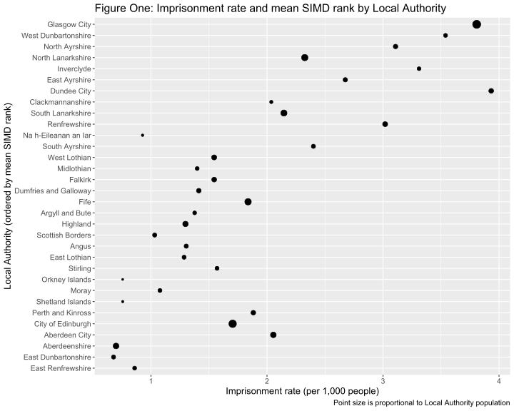
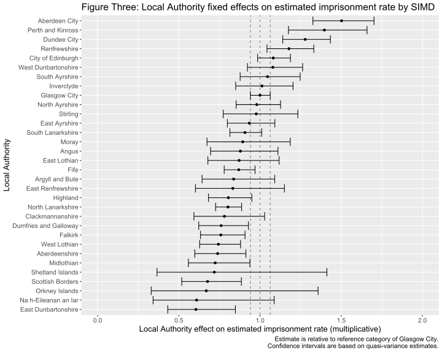

Is the relationship between imprisonment and deprivation in Scotland at
its most pronounced in Glasgow?
================
Ben Matthews
2019-04-01

*This paper is a slightly expanded version of pages 51-58 in the*
[Howard League for Penal Reform Early Career Academics Network Bulletin
Issue 41](https://howardleague.org/wp-content/uploads/2019/04/ECAN-bulletin-Spring-2019-1.pdf)
*which provides more detail on the methods used, including* *a technical
appendix and references.*

# Introduction

Previous research has established that there is a strong link between a
neighbourhood’s level of deprivation and its imprisonment rate, a link
notably illustrated in Scotland by Roger Houchin’s 2005 report *Social
Exclusion and Imprisonment in Scotland*.\[1\] This report also outlined
differences in the relationship between deprivation and imprisonment
between Scottish regions, in particular suggesting that this
relationship was “at its most pronounced in Glasgow” (2005,:43).

But a lot has changed since 2005. This was the same year in which
Glasgow was given the title of “Murder Capital of Europe” - but since
then the city has seen a marked fall in its violent crime rate (McVie,
Bates, and Pillinger 2018), and recorded crime has fallen across all
Local Authorities in Scotland. Alongside this sustained crime drop,
researchers have also shown that geographical patterns of poverty and
deprivation are changing in the UK, with increasing poverty in the
suburbs and falls in poverty in inner cities (Bailey and Minton 2018).
In the USA, researchers have suggested that similar trends in the
suburbanisation of poverty have led to an increasing suburbanisation of
prisoner re-entry (Kirk 2016), and others others have shown high
imprisonment rates from satellite cities, away from large urban centres
(Simes 2018).

The Understanding Inequalities project\[2\] aims to understand the
causes and consequences of these kinds of changing patterns of
inequality across Scottish society. As part of this project I have used
contemporary data and methods to revisit Houchin’s claim that the
deprivation/imprisonment relationship in Scotland is still at its
strongest in Glasgow, and this paper aims to investigate whether
Houchin’s contention still holds by exploring regional variation in
the relationship between deprivation and imprisonment in Scotland.

# Research Design

## Data

### Imprisonment

To explore regional variation in the relationship between deprivation
and imprisonment in Scotland I use data describing the numbers of
prisoners who had home addresses registered in different neighbourhoods
on a single night in 2014. Neighbourhoods are measured by data-zones, a
statistical geography designed to group together households with similar
social characteristics. Data was kindly provided by the Scottish
Government.

An important feature of the imprisonment data is that it represents a
snapshot of the prison population on one night. We should be cautious
about reading data on counts of people registered to different
data-zones as generalizing to other days or times, especially given that
people both enter and leave prison every day. For example, 33,626 people
entered Scottish prisons in 2013/14, compared to a daily average prison
population of 7,894 (Scottish Government 2015). Given that the 76% of
data-zones have either zero or one person registered as being in prison,
a single person being released or entering prison could make a
substantial impact on a data-zone’s imprisonment rate. This effect is
amplified for small Local Authorities which may only contain 20 or 30
data-zones.

### Deprivation

One advantage of using data-zones as the geographical unit of analysis
is that they are easily combined with information from the Scottish
Index of Multiple Deprivation (SIMD). SIMD is a measure which ranks each
neighbourhood in Scotland across different ‘domains’ - income,
employment, health, crime, housing, geographic access to services and
education, skills and training - which are then synthesized into a
single ranked list of all neighbourhoods in Scotland\[3\].

Because SIMD measures the *ordering* of data-zones by their levels of
deprivation, rather than their *absolute* levels of deprivation, the
underlying difference in deprivation between data-zones with adjacent
ranks can be very small or very large. Moreover, “not everyone who is
deprived lives in a deprived area” (Scottish Government 2016), and so
there will be people experiencing deprivation but in areas that are, on
average, not deprived. However, as the domains included in SIMD have
significant overlap with the factors identified by Simes (2018) as being
relevant to estimating the relationship between deprivation and
imprisonment, SIMD is a suitable indicator of deprivation for this
analysis.

## Methods

Houchin’s claim that the relationship between deprivation and
imprisonment was most pronounced in Glasgow was based on the observation
that Glasgow City local authority had particularly high imprisonment
rates and also high levels of deprivation.

I take a slightly different to Houchin, and instead describe how the
relationship between deprivation and imprisonment varies across Scotland
using the following steps:

  - **First**, I show descriptive statistics of imprisonment rate and
    average deprivation by Local Authority.
  - **Second**, I fit a regression model to describe the number of
    people in prison with a home address registered to a given data-zone
    as a function of deprivation, in this case measured by overall SIMD
    rank. I specified a Generalized Additive Model (GAM) (Wood 2017)
    which could account for the non-linear relationship between the
    number of people in prison and the SIMD rank variables (see Matthews
    and McVie 2018) and the count distribution of the dependent
    variable\[4\].
  - **Finally**, I include Local Authority in the regression model to
    assess the differences between Local Authorities in the effect of
    deprivation on a neighbourhood’s imprisonment rate.\[5\]

This approach lets us see how imprisonment rates vary between Local
Authorities once we control for their differing levels of deprivation.
This model assumes that the *only* factor affecting a data-zone’s
imprisonment rate is it’s SIMD rank. We should therefore treat the
results of this analysis with some caution, understanding them as a
rough estimate of the regional variation in imprisonment rates by SIMD;
to echo John Tukey, they are an approximate answer, but hopefully to the
right question (1962,:13–14).

# Results

## Descriptive Statistics

Figure One shows the imprisonment rate across Local Authorities in 2014.
In this figure Local Authorities run down the *y*-axis, ordered by their
average SIMD score. We can see that Glasgow City is the Local Authority
with the lowest average SIMD rank (i.e. it is on average the most
deprived) and has the second highest imprisonment rate.

This figure gives an initial sense of the relationship between SIMD and
imprisonment at the Local Authority level, as Local Authorities with
higher average SIMD (those at the top of the figure) tend also to have
higher average imprisonment rates. However, there are exceptions to this
pattern; Dundee City has the highest imprisonment rate but only the
7th highest average SIMD rank and towards the bottom of the
graph Aberdeen City, City of Edinburgh and Perth and Kinross (which is
adjacent to Dundee City) also seem to have higher imprisonment rates
than other Local Authorities with lower average SIMD ranks.

<!-- -->

### Regression results

The GAM does not provide a single parameter estimate for the effect of
SIMD on imprisonment because this effect is modelled as non-linear, and
so varies for different values of SIMD. Instead, it’s easiest to
understand the model by plotting the predicted values as in Figure Two,
which shows the estimated data-zone imprisonment rates from the
regression model plotted across the range of SIMD ranks.\[6\] From this
figure we can see that the estimate of the imprisonment rate increases
as SIMD rank decreases, and that this change is more pronounced at
higher levels of deprivation (i.e. lower SIMD ranks), as the regression
line curves upwards towards the left-hand side of the plot. This
non-linearity means that there is a larger change in the estimated
imprisonment rate between the data-zones ranked 10 and 11 by SIMD than
those ranked 6010 and
6011.

<!-- -->

To explore the Local Authority variation in this relationship I added a
fixed effect for Local Authority to the model\[7\]. This fixed effect
allows the estimate of the imprisonment rate given SIMD to shift up or
down for each Local Authority in comparison to Glasgow City, which I set
as the reference class in the model.

Figure Three shows the coefficient estimates for each Local Authority.
The figure shows that eight Local Authorities had higher estimated
imprisonment rates than Glasgow City after controlling for SIMD, but
there are three Local Authorities - Aberdeen City, Perth and Kinross and
Dundee City - where the quasi-confidence intervals for the model
estimates do not overlap with those for Glasgow City, suggesting these
differences are statistically significant. (The online technical
appendix show that the difference between Glasgow and Renfrewshire is
also statistically significant at *p \<* 0.05, despite the overlap in
the quasi-confidence intervals.)

<!-- -->

These results show that the relationship between imprisonment and
deprivation is not at its most pronounced in Glasgow City - it is
data-zones in Aberdeen City which have the highest estimated
imprisonment rate once deprivation is controlled for. These results are
multiplicative so the model’s estimate of the number of people in prison
in Aberdeen City Local Authority is around 1.5 times that of a data-zone
in Glasgow City with the same SIMD
rank.

<!-- -->

We can see this difference between Glasgow City and Aberdeen City in
Figure Four. Similar to Figure Two, this shows the estimated
imprisonment rate against SIMD, but this time with a separate line for
the fixed effect of each Local Authority. Estimates for Glasgow City,
Aberdeen City and Scottish Borders are highlighted to indicate the range
of differences between Local Authorities, with those for data-zones in
Aberdeen City being higher than in Glasgow City for the same SIMD rank
and those for Scottish Borders being lower. These Local Authority
estimates fan out around the Glasgow City estimate with eight Local
Authorities having higher estimates and 23 having lower estimates as in
Figure Three.

# Discussion

These results suggest that Glasgow City Local Authority does not have
the ‘most pronounced’ relationship between imprisonment and deprivation.
How then do we explain the higher imprisonment rates in Glasgow City
compared to, say, Aberdeen City? Its because, as we saw in Figure One,
Glasgow City has more data-zones with high SIMD-ranks than Aberdeen
City. So despite our best guess of the imprison rate of a given
data-zone in Aberdeen City being higher than a data-zone with the same
SIMD rank in Glasgow City, we see a higher overall imprisonment rate in
Glasgow City. The *statistical* relationship between imprisonment and
deprivation was stronger in Aberdeen than in Glasgow, but Glasgow City
had a higher imprisonment rate - because the ‘average’ neighbourhood in
Glasgow was more deprived than the ‘average’ neighbourhood in Aberdeen.

These findings contrast with Roger Houchin’s description of the
situation in 2005. However, we should be skeptical as to whether this
estimate of the difference between, say, Aberdeen City and Glasgow City
in the relationship between imprisonment and deprivation is the ‘true’
difference in the relationship between imprisonment and deprivation
between these Local Authorities. As discussed previously, data from a
different day may show different trends and there are likely to be other
factors which would predict an area’s imprisonment rate other than SIMD
which may have changed results if included in the model.

Moreover, whilst the data-zone’s crime rate contributes to its SIMD
rank, this model does not take account of different crime patterns at
the Local Authority Level, such as the mix of offence types which come
before courts. As a consequence, we should not read these model results
as implying sentencing disparities across Scotland, as courts in
different Local Authorities may be hearing different types of cases -
this is an issue that I have not explored in this analysis.

# Conclusions

By examining Local Authority differences in the strength of the
SIMD/imprisonment relationship we’ve seen that in 2014 this relationship
was not at its most pronounced in Glasgow - at least based on the
methods and data used here. This discrepancy could be due to the
differences between Houchin’s work and this analysis in the data and
methods used, or they could represent actual change in geographical
patterns of imprisonment in Scotland. This paper is a starting point in
investigating these issues; for example, with longitudinal data on
data-zone imprisonment counts it would be possible to explore the issues
raised by Kirk (2016) and Simes (2018) as to whether patterns of
receptions and liberations have also shifted in Scotland alongside
changes in the geographical distribution of deprivation and poverty.
This is of more than just academic interest given the Scottish Prison
Service’s emphasis on the importance of working with communities to
reduce reoffending (Scottish Prison Service and APS Group Scotland
2013). As communities and their experiences of inequality themselves can
change over time, more than ever we need to understand how inequality
affects areas with high imprisonment rates and how changing patterns of
inequality in Scottish society filter through the justice system.

# References

Bailey, Nick, and Jon Minton. 2018. “The Suburbanisation of Poverty in
British Cities, 2004-16: Extent, Processes and Nature.” *Urban
Geography* 39 (6): 892–915.
<https://doi.org/10.1080/02723638.2017.1405689>.

Bell, Andrew, Malcolm Fairbrother, and Kelvyn Jones. 2018. “Fixed and
Random Effects Models: Making an Informed Choice.” *Quality & Quantity*,
August. <https://doi.org/10.1007/s11135-018-0802-x>.

Firth, David. 2017. *Qvcalc: Quasi Variances for Factor Effects in
Statistical Models*. <https://CRAN.R-project.org/package=qvcalc>.

Gayle, Vernon, and Paul S. Lambert. 2007. “Using Quasi-Variance to
Communicate Sociological Results from Statistical Models.” *Sociology*
41 (6): 1191–1208. <https://doi.org/10.1177/0038038507084830>.

Houchin, Roger. 2005. “Social Exclusion and Imprisonment in Scotland.”
<https://www.scotpho.org.uk/media/1108/socialexclusionandimprisonmentinscotland.pdf>.

Kirk, David S. 2016. “Prisoner Reentry and the Reproduction of Legal
Cynicism.” *Social Problems* 63 (2): 222–43.
<https://doi.org/10.1093/socpro/spw003>.

Matthews, Ben, and Susan McVie. 2018. “Critical Issues in Scottish Penal
Policy: Inequality & Imprisonment.” *Howard League Scotland*.
<http://howardleague.scot/news/2018/september/critical-issues-scottish-penal-policy-inequality-imprisonment>.

McVie, Susan, Ellie Bates, and Rebecca Pillinger. 2018. “Changing
Patterns of Violence in Glasgow and London: Is There Evidence of
Scottish Exceptionalism?” *LSE British Politics and Policy Blog*.
<http://blogs.lse.ac.uk/politicsandpolicy/patterns-of-violence-glasgow-london/>.

R Core Team. 2018. *R: A Language and Environment for Statistical
Computing*. Vienna, Austria: R Foundation for Statistical Computing.
<https://www.R-project.org/>.

Scottish Government. 2015. “Prison Statistics and Population Projections
Scotland: 2013-14.” <https://www2.gov.scot/Publications/2015/12/5123>.

———. 2016. “Introducing the Scottish Index of Multiple Deprivation
2016.”

Scottish Prison Service, and APS Group Scotland. 2013. *Unlocking
Potential: Report of the Scottish Prison Service Organisational Review*.
<http://www.nls.uk/e-monographs/2013/9780857590145.pdf>.

Simes, Jessica T. 2018. “Place and Punishment: The Spatial Context of
Mass Incarceration.” *Journal of Quantitative Criminology* 34 (2):
513–33. <https://doi.org/10.1007/s10940-017-9344-y>.

Tukey, John W. 1962. “The Future of Data Analysis.” *The Annals of
Mathematical Statistics* 33 (1): 1–67.

Wood, Simon N. 2017. *Generalized Additive Models: An Introduction with
R*. Chapman; Hall/CRC.

1.  Susan McVie and I recently re-visited two of Houchin’s claims about
    the relationship between deprivation and imprisonment (Matthews and
    McVie 2018) and found that it was still the case that there is both
    a strong association between deprivation and imprisonment and also
    that there is a lot of variation in this relationship so that
    neighbourhoods with similar levels of deprivation can have very
    different imprisonment rates.

2.  More information about the Understanding Inequalities project is
    available at <http://www.understanding-inequalities.ac.uk/>.

3.  More information on SIMD is available here at
    <https://www2.gov.scot/Topics/Statistics/SIMD>.

4.  The GAM used a log link and a quasi-poisson distribution to account
    for the distribution of the imprisonment data. The model was fit in
    the `R` statistical program version 3.5.1 (R Core Team 2018), using
    the `mgcv` package (Wood 2017). Rather than specifying a particular
    function for the relationship between SIMD and imprisonment - for
    example, that we can describe the imprisonment rate in an area by
    SIMD and SIMD-squared - the GAM estimates the appropriate shape of
    the relationship based on the data. Code used to fit the model is
    available in the [technical
    appendix](https://github.com/benmatthewsed/simd-imprisonment-online/blob/master/howard_league_ecan_technical_appendices.md).

5.  Uncertainty in the effect of Local Authority on the
    SIMD/imprisonment relationship is expressed by confidence intervals
    constructed using quasi-variance standard errors using the `qvcalc`
    `R` package (Firth 2017). This procedure accounts for the
    reference-category problem, wherein the Local Authority used as the
    reference category in the regression model is constrained to have
    zero-variance, affecting comparisons between other Local
    Authorities. Gayle and Lambert (2007) provide an introduction to
    this problem for social scientists, and advocate the reporting of
    quasi-variance estimates as a solution. Original standard errors are
    presented in the online technical appendix.

6.  Typically a GAM would be assessed with a partial residual plot of
    each independent variable once all other variables in the model were
    held constant - but as there is only one variable in this model this
    is not necessary.

7.  It is fixed in the sense that each Local Authority is given an
    estimate, rather than providing an overall estimate for all Local
    Authorities as if they are drawn from a random distribution. (Bell,
    Fairbrother, and Jones 2018) have helpful advice on the
    circumstances when fixed or random effects should be preferred.
